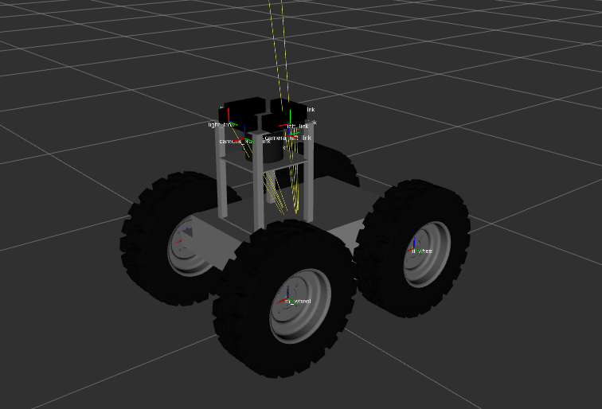
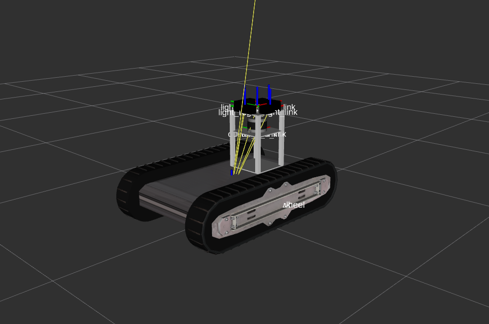
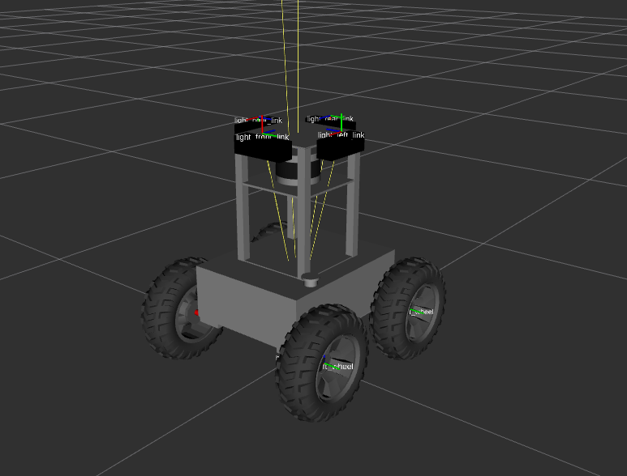

# Coordinated Robotics

This repository contains the ROS 2 workspace packages and setup for the Coordinated Robotics `cororos2` robots. It currently includes ROS 2 description, bringup, simulation, sensor and drivers integration work for **Allie / Ames**, **Cornelius / Julius**, and **Joe / Jeanine**.

> [!WARNING]
> This repository is under active development. Some robots still contain only partial ROS 2 support, and some hardware integrations are present in launch files but are not yet validated on the real robot.

## Overview

The repository is the ROS 2 port of several robots and currently contains the most complete ROS 2 implementations for **Allie / Ames**, **Cornelius / Julius**, and **Joe / Jeanine**.

- **Robot-specific base backends:**
  - Allie: PWM hardware interface
  - Cornelius: Roboclaw hardware interface
  - Joe: ODrive hardware interface

- **Allie hardware context:**
  - Ouster OS0-128 lidar
  - Intel RealSense D455 camera
  - u-blox ZED-F9P GPS
  - Memsense MS-IMU3025 IMU
  - Pololu Micro Maestro PWM controller
  - REV SPARK MAX motor controller using RC PWM input

- **Cornelius hardware context:**
  - Ouster OS0-128 lidar
  - Intel RealSense D455 camera
  - u-blox ZED-F9P GPS
  - Memsense MS-IMU3025 IMU
  - Roboclaw 2x60A motor controller

- **Joe hardware context:**
  - Velodyne VLP-16 lidar
  - Intel RealSense D455 camera
  - u-blox ZED-F9P GPS
  - Memsense MS-IMU3025 IMU
  - custom hoverboard-motor platform driven by ODrive v3.6 motor controllers

- **Current package focus:**
  - `cororos2_description`
  - `cororos2_bringup`
  - `memsense_msimu3025_driver`
  - `pwm_hardware_interface`
  - `roboclaw_hardware_interface`
  - `odrive_hardware_interface`

## Workspace setup

There are two ways to set up the workspace.

### 1. If you are using RTW

If you have installed RTW from the [RTW installation guide](https://rtw.b-robotized.com/master/tutorials/setting_up_rtw.html#installation-of-rtw), you can create and build the workspace in following way:

```bash
rtw workspace create --ws-folder cororos_ws --ros-distro jazzy
rtw ws cororos_ws
rosds
git clone -b ros2 git@github.com:b-robotized-forks/cororos2.git
rosdep_prep
export PIP_BREAK_SYSTEM_PACKAGES=1
rosdepi
cb
```

If GitHub SSH is not configured on your machine yet, you can clone the public repository over HTTPS instead:

```bash
git clone -b ros2 https://github.com/b-robotized-forks/cororos2.git
```

### 2. Manual workspace setup

If you are not using RTW, follow these steps.

#### Clone the repository into your ROS 2 workspace

From the root of your workspace (for example `~/cororos2_ws`):

```bash
mkdir -p ~/cororos2_ws/src
cd ~/cororos2_ws/src
git clone -b ros2 git@github.com:b-robotized-forks/cororos2.git cororos2
```

#### Install ROS 2 dependencies

```bash
sudo apt update
sudo apt install -y python3-pip
rosdep update
export PIP_BREAK_SYSTEM_PACKAGES=1
```

Install package dependencies from the workspace root:

```bash
cd ~/cororos2_ws
rosdep install --from-paths src --ignore-src -r -y
```

The package manifests declare the ROS 2 control, Gazebo, RViz, and hardware-driver dependencies, so `rosdep install` is the supported way to install them. Separate `sudo apt install ros-jazzy-...` commands are not needed.

#### Build the workspace

```bash
cd ~/cororos2_ws
source /opt/ros/jazzy/setup.bash
colcon build --symlink-install
source install/setup.bash
```

Now the workspace is ready for use.

## Starting the Robots

The bringup files use the shared `robot_model` argument. Replace `<robot_model>` with one of:

- `allie`
- `cornelius`
- `joe`

Open a new terminal and source the workspace before launching:

```bash
cd ~/cororos2_ws
source install/setup.bash
```

### Check the Robot Description

Use this first if you only want to confirm that the URDF, meshes, and TF tree load correctly:

```bash
ros2 launch cororos2_description view_robot.launch.xml robot_model:=<robot_model>
```

This starts the URDF, `robot_state_publisher`, `joint_state_publisher_gui`, and the common RViz config.

Example RViz views:

| Allie | Cornelius | Joe |
| --- | --- | --- |
|  |  |  |

### Simulation Bringup

1. Start the robot in Gazebo:

   ```bash
   ros2 launch cororos2_bringup robot_gz.launch.xml robot_model:=<robot_model>
   ```

2. To run Gazebo without RViz:

   ```bash
   ros2 launch cororos2_bringup robot_gz.launch.xml robot_model:=<robot_model> rviz:=false
   ```

3. Check simulated sensor topics:

   ```bash
   ros2 topic list | grep '^/<robot_model>/'
   ros2 topic echo /<robot_model>/imu/data --once
   ros2 topic echo /<robot_model>/lidar/scan --once
   ```

### Offline Mock Bringup

Use offline/mock bringup when you want ROS 2 control, robot state, and RViz without Gazebo or real hardware:

```bash
ros2 launch cororos2_bringup cororos2_offline.launch.xml robot_model:=<robot_model>
```

This wrapper uses mock hardware and is useful for checking controllers, descriptions, topic names, and launch arguments.

### Hardware Bringup

1. Check the available launch arguments:

   ```bash
   ros2 launch cororos2_bringup cororos2_hw.launch.xml --show-args
   ```

2. Check serial devices before launching hardware:

   ```bash
   ls -l /dev/serial/by-id/
   ```

3. You must pass the correct hardware paths, serial numbers, and IP addresses for the robot.

   Do not copy placeholders like `<your-device>`, `<front-serial>`, or `<sensor-ip>` into a real launch command. Replace them with the actual hardware values for the connected robot.

   Common hardware selectors:

   - Allie: `pwm_device_path`, `ouster_sensor_hostname`, `ouster_udp_dest`
   - Cornelius: `roboclaw_device`, `ouster_sensor_hostname`, `ouster_udp_dest`
   - Joe: `odrive_front_serial_number`, `odrive_rear_serial_number`, `velodyne_device_ip`
   - Optional sensors: `realsense_serial_no`, `gps_device`, `memsense_device`

4. Start the full hardware stack:

   ```bash
   ros2 launch cororos2_bringup cororos2_hw.launch.xml robot_model:=<robot_model>
   ```

   This launches robot/control bringup and the sensor bringup together, and forces real hardware mode.

5. You must pass the robot-specific hardware selectors with the correct paths, serial numbers, and IP addresses.

   **Examples:**

   Allie with Maestro PWM base and Ouster:

   ```bash
   ros2 launch cororos2_bringup cororos2_hw.launch.xml robot_model:=allie \
     pwm_device_path:=/dev/serial/by-id/<your-maestro-id> \
     ouster_sensor_hostname:=<sensor-ip> \
     ouster_udp_dest:=<host-ip>
   ```

   Cornelius with Roboclaw:

   ```bash
   ros2 launch cororos2_bringup cororos2_hw.launch.xml robot_model:=cornelius \
     roboclaw_device:=/dev/serial/by-id/<your-device>
   ```

   Cornelius with encoder-based Roboclaw odometry:

   ```bash
   ros2 launch cororos2_bringup cororos2_hw.launch.xml robot_model:=cornelius \
     roboclaw_use_encoder:=true \
     roboclaw_device:=/dev/serial/by-id/<your-device>
   ```

   Joe with ODrive base and Velodyne:

   ```bash
   ros2 launch cororos2_bringup cororos2_hw.launch.xml robot_model:=joe \
     odrive_front_serial_number:=<front-serial> \
     odrive_rear_serial_number:=<rear-serial> \
     velodyne_device_ip:=<sensor-ip>
   ```

6. Add optional sensor selectors when more than one device is connected.

   **Examples:**

   RealSense on any robot:

   ```bash
   ros2 launch cororos2_bringup cororos2_hw.launch.xml robot_model:=<robot_model> \
     realsense_serial_no:="'<serial>'"
   ```

   GPS on any robot:

   ```bash
   ros2 launch cororos2_bringup cororos2_hw.launch.xml robot_model:=<robot_model> \
     gps_device:=/dev/ttyACM0
   ```

   Memsense IMU on any robot:

   ```bash
   ros2 launch cororos2_bringup cororos2_hw.launch.xml robot_model:=<robot_model> \
     memsense_device:=/dev/serial/by-id/<your-device>
   ```

7. Check hardware sensor topics:

   ```bash
   ros2 topic list | grep '^/<robot_model>/'
   ros2 topic echo /<robot_model>/imu/data --once
   ros2 topic echo /<robot_model>/gps/fix --once
   ros2 topic echo /<robot_model>/lidar/scan --once
   ```

### Standalone Debug Launches

Start only robot/control bringup:

```bash
ros2 launch cororos2_bringup cororos2_bringup.launch.xml robot_model:=<robot_model>
```

This is the base launch used by the wrappers. By default it uses `use_mock_hardware:=true` and `rviz:=true`.

Start only the hardware sensor stack:

```bash
ros2 launch cororos2_bringup cororos2_sensors.launch.xml robot_model:=<robot_model>
```

This is useful when the base bringup is already running in another terminal and you only want to debug sensors.

### Direct Drive Test

Drive the robot directly through the diff-drive controller:

```bash
ros2 topic pub -r 10 /diff_drive_controller/cmd_vel geometry_msgs/msg/TwistStamped "{header: {stamp: {sec: 0, nanosec: 0}, frame_id: ''}, twist: {linear: {x: 0.5, y: 0.0, z: 0.0}, angular: {x: 0.0, y: 0.0, z: 0.2}}}"
```

This is useful for base controller testing in both simulation (mock/Gazebo) and for real hardware, without the teleop mux or Nav2. The `diff_drive_controller` has a `cmd_vel_timeout` of `0.5 s`, so velocity commands must publish faster than that.

## Hardware bringup notes

The following hardware drivers are integrated into `cororos2_hw.launch.xml`:

- **Ouster lidar** via `ouster_ros`
- **Velodyne VLP-16** via `velodyne_driver`, `velodyne_pointcloud`, and `velodyne_laserscan`
- **Intel RealSense D455** via `realsense2_camera`
- **u-blox GPS** via `ublox_gps`
- **Memsense IMU** via `memsense_msimu3025_driver`
- **Allie Maestro PWM backend** via `pwm_hardware_interface`
- **Cornelius Roboclaw base backend** via `roboclaw_hardware_interface`
- **Joe ODrive base backend** via `odrive_hardware_interface`

> [!WARNING]
> The drivers still need hardware validation.

### Device permissions

Some hardware backends use serial devices under `/dev/ttyUSB*`, `/dev/ttyACM*`, or `/dev/serial/by-id/...`. On Ubuntu these devices are commonly owned by the `dialout` group. If a hardware launch fails with a permission error while opening a serial device, add your user to `dialout`:

```bash
sudo usermod -a -G dialout $USER
```

Joystick and gamepad devices are commonly exposed through `/dev/input/...`. If joystick input fails with a permission error, add your user to `input`:

```bash
sudo usermod -a -G input $USER
```
Log out and back in, or reboot, before trying again.

### Robot-specific defaults

- `robot_model:=allie`: PWM base, Ouster lidar
- `robot_model:=cornelius`: Roboclaw base, Ouster lidar
- `robot_model:=joe`: ODrive base, Velodyne VLP-16 lidar

> [!NOTE]
> The ODrive backend helper uses the Python `odrive` module. If you install workspace dependencies with `rosdep`, it is pulled in through the `python3-odrive-pip` rosdep key. Otherwise install it manually with `python3 -m pip install --upgrade odrive`.

## Zenoh (optional DDS alternative / bridge)

This workspace can also be used with Zenoh to enable communication across networks, for example multiple machines or cloud setups.

1. Configure ROS 2 to use Zenoh

Zenoh is enabled via environment variables. You can set them permanently either in `~/.ros_team_ws_rc` or temporarily in each terminal:

```bash
export RMW_IMPLEMENTATION=rmw_zenoh_cpp
```

2. Launch the Zenoh router

Start the router in a dedicated terminal:

```bash
rtw-zenoh-router
```

This is enough for local setups.

For multi-machine setups, start the router with the remote endpoint:

```bash
rtw-zenoh-router <router-ip>
```

Or set the env variable:

```bash
export ZENOH_CONNECT_IP=192.168.28.28
```

> [!NOTE]
> The router is started once, not per terminal.
> Environment variables must be set in every terminal running ROS 2.
> You need to have RTW installed and a RTW workspace.

## Troubleshooting

1. *Controllers are already loaded or active.*
   This usually means stale nodes from a previous launch are still running.
   ```bash
   pkill -f ros2_control_node
   pkill -f controller_manager/spawner
   pkill -f robot_state_publisher
   ```
   Then relaunch once from a clean terminal.

2. *The base drive returns to neutral while testing.*
   `diff_drive_controller` uses `cmd_vel_timeout: 0.5`, so publish `cmd_vel` faster than that. Otherwise, the controller may time out between messages and cause intermittent wheel turning. For example:
   ```bash
   ros2 topic pub -r 10 /cmd_vel geometry_msgs/msg/Twist "{linear: {x: 1.0}, angular: {z: 0.5}}"
   ```

3. *Serial devices or joystick input fail with permission errors.*
   Show input devices and their permissions / groups. This is useful to confirm joystick or gamepad devices are owned by `input` or another group:
   ```bash
   ll /dev/input
   ```
   Show whether the `dialout` group exists and which users are in it:
   ```bash
   cat /etc/group | grep dialout
   ```
   Show whether the `input` group exists and which users are in it:
   ```bash
   cat /etc/group | grep input
   ```
   If your user is not listed in the needed group, add it:
   ```bash
   sudo usermod -a -G dialout $USER
   sudo usermod -a -G input $USER
   ```
   Log out and back in, or reboot, before trying again.

## Roboclaw Diagnostics And Telemetry

Cornelius's `roboclaw_hardware_interface` publishes `/diagnostics` with one Roboclaw diagnostic entry. The diagnostic message reports conditions such as overcurrent, emergency stop, battery voltage faults, driver faults, and temperature faults.

The Roboclaw diagnostic includes:

- `device`
- `address`
- `main_battery_voltage_v`
- `logic_battery_voltage_v`
- `m1_current_a`
- `m2_current_a`
- `temp1_c`
- `temp2_c`
- `error_word`

Published telemetry topics:

- `roboclaw/battery_state`
- `roboclaw/logic_battery_voltage`
- `roboclaw/m1_current`
- `roboclaw/m2_current`
- `roboclaw/temp1`
- `roboclaw/temp2`
